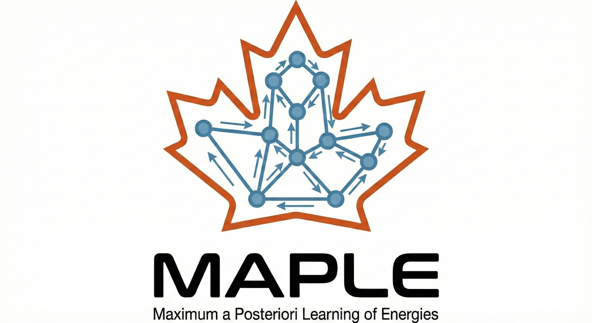

MAPLE Documentation
===================

|

**MAPLE (Maximum A Posteriori Learning of Energies)** is a Python package for analyzing Free Energy Perturbation (FEP) data using probabilistic variational estimators, deterministic graph methods, and Bayesian inference.

MAPLE provides tools for:

* **Probabilistic Inference**: MAP, MLE, VI, and GMVI methods for node value estimation
* **Deterministic Graph Methods**: Weighted Cycle Closure (WCC) and Spectral Free-energy Correction (WSFC/SFC)
* **Outlier Detection**: Probabilistic identification of problematic FEP edges via mixture models
* **Uncertainty Quantification**: Full posterior distributions, Laplacian-based uncertainties, and bootstrap confidence intervals
* **Performance Tracking**: Comprehensive tracking and comparison of model performance
* **Statistical Analysis**: Bootstrap confidence intervals and performance metrics
* **Visualization**: Professional plotting tools for FEP analysis

Methods Overview
----------------

MAPLE implements both probabilistic and deterministic approaches for inferring absolute free energies from relative FEP measurements:

.. list-table::
   :header-rows: 1
   :widths: 12 25 15 48

   * - Method
     - Class
     - Type
     - Description
   * - MAP
     - ``VariationalEstimator``
     - Probabilistic
     - Maximum A Posteriori: regularized least squares via Bayesian prior
   * - MLE
     - ``VariationalEstimator``
     - Probabilistic
     - Maximum Likelihood: ordinary least squares with uniform prior
   * - VI
     - ``VariationalEstimator``
     - Probabilistic
     - Variational Inference: full posterior approximation with uncertainties
   * - GMVI
     - ``GaussianMixtureVI``
     - Probabilistic
     - Gaussian Mixture VI: outlier-robust inference with mixture likelihood
   * - WCC
     - ``CycleClosureCorrection``
     - Deterministic
     - Weighted Cycle Closure: iterative thermodynamic consistency correction
   * - WSFC
     - ``SpectralCorrection``
     - Deterministic
     - Weighted Spectral Free-energy Correction via graph Laplacian pseudoinverse
   * - SFC
     - ``SpectralCorrection``
     - Deterministic
     - Unweighted Spectral Correction (equivalent to MLE)

Core Architecture: Dataset-Centric Design
------------------------------------------

MAPLE uses a **dataset-centric architecture** where the ``FEPDataset`` object serves as the central hub for all data and predictions. Models read from the dataset, perform inference, and write their predictions back to the dataset.

.. code-block:: text

   +------------------------------------------------------------------+
   |                  FEPDataset (Central Hub)                         |
   +------------------------------------------------------------------+
   |  dataset_nodes | dataset_edges | cycle_data | estimators[]        |
   +--------+---------------------------+---------+-------------------+
            |                           |
            | get_graph_data()          | add_predictions_to_dataset()
            v                           |
   +------------------------------------------------------------------+
   |                         Models                                    |
   +------------------------------------------------------------------+
   | VariationalEstimator  | GaussianMixtureVI  | CycleClosureCorrection |
   | (MAP / VI / MLE)      | (outlier detection)| (cycle closure)        |
   |                       |                    |                        |
   | SpectralCorrection    |                    |                        |
   | (graph Laplacian)     |                    |                        |
   +------------------------------------------------------------------+
            |
            | add_predictions_to_dataset()
            v
   +------------------------------------------------------------------+
   |                  Results Added to Dataset                         |
   +------------------------------------------------------------------+
   | 'MAP' | 'VI' | 'GMVI' | 'WCC' | 'WSFC'/'SFC'                    |
   +------------------------------------------------------------------+

This design allows you to:

1. **Fit multiple models** on the same dataset
2. **Compare predictions** side-by-side in the dataset DataFrames
3. **Track which models** have been applied via ``dataset.estimators``
4. **Access all results** from a single dataset object

Quick Start
-----------

.. code-block:: python

   from maple.dataset import FEPDataset
   from maple.models import (
       VariationalEstimator, VariationalEstimatorConfig,
       GaussianMixtureVI, GaussianMixtureVIConfig,
       SpectralCorrection, SpectralCorrectionConfig,
       PriorType, GuideType
   )

   # Step 1: Create dataset from benchmark or your own data
   dataset = FEPDataset(dataset_name="cdk8", sampling_time="5ns")

   # Step 2: Configure and fit MAP model
   map_config = VariationalEstimatorConfig(
       learning_rate=0.01,
       num_steps=1000,
       prior_type=PriorType.NORMAL,
       guide_type=GuideType.AUTO_DELTA  # MAP inference
   )
   map_model = VariationalEstimator(config=map_config, dataset=dataset)
   map_model.fit()
   map_model.add_predictions_to_dataset()  # Adds 'MAP' column

   # Step 3: Configure and fit GaussianMixtureVI model (with outlier detection)
   gmvi_config = GaussianMixtureVIConfig(prior_std=5.0, outlier_prob=0.2)
   gmvi_model = GaussianMixtureVI(dataset=dataset, config=gmvi_config)
   gmvi_model.fit()
   gmvi_model.get_results()
   gmvi_model.add_predictions_to_dataset()  # Adds 'GMVI' column

   # Step 4: Fit SpectralCorrection (WSFC) model
   wsfc_config = SpectralCorrectionConfig(use_weights=True)
   wsfc_model = SpectralCorrection(config=wsfc_config, dataset=dataset)
   wsfc_model.fit()
   wsfc_model.add_predictions_to_dataset()  # Adds 'WSFC' column

   # Step 5: Access all predictions from the dataset
   print(dataset.dataset_nodes.columns)
   print(dataset.estimators)
   # ['MAP', 'GMVI', 'WSFC']

Installation
------------

.. code-block:: bash

   pip install maple-fep

Or for development:

.. code-block:: bash

   git clone https://github.com/aakankschit/MAPLE-fep.git
   cd MAPLE-fep
   pip install -e ".[dev]"

Table of Contents
-----------------

.. toctree::
   :maxdepth: 2
   :caption: User Guide

   user_guide/installation
   user_guide/quickstart
   user_guide/architecture
   user_guide/tutorials
   user_guide/parameter_optimization

.. toctree::
   :maxdepth: 2
   :caption: Methods & Theory

   methods_comparison

.. toctree::
   :maxdepth: 2
   :caption: API Reference

   api/models
   api/dataset
   api/utils
   api/graph_analysis

.. toctree::
   :maxdepth: 1
   :caption: Interactive Tutorials

   tutorials/index

.. toctree::
   :maxdepth: 1
   :caption: Examples

   examples/basic_usage
   examples/parameter_sweeps
   examples/fep_benchmark_tutorial

.. toctree::
   :maxdepth: 1
   :caption: Developer Guide

   developer/contributing

Indices and tables
==================

* :ref:`genindex`
* :ref:`modindex`
* :ref:`search`
